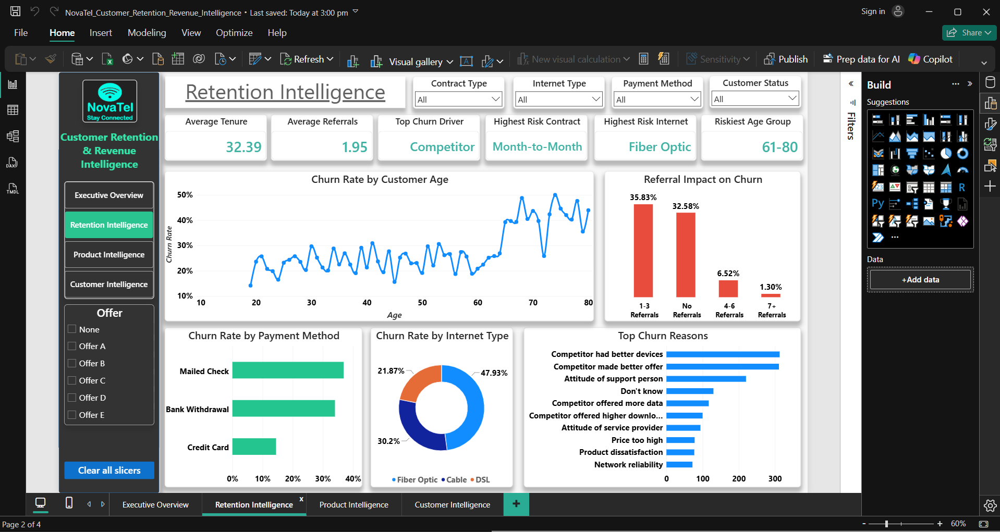
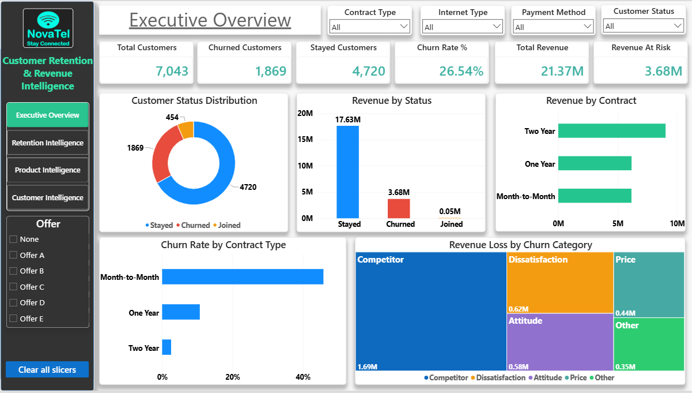
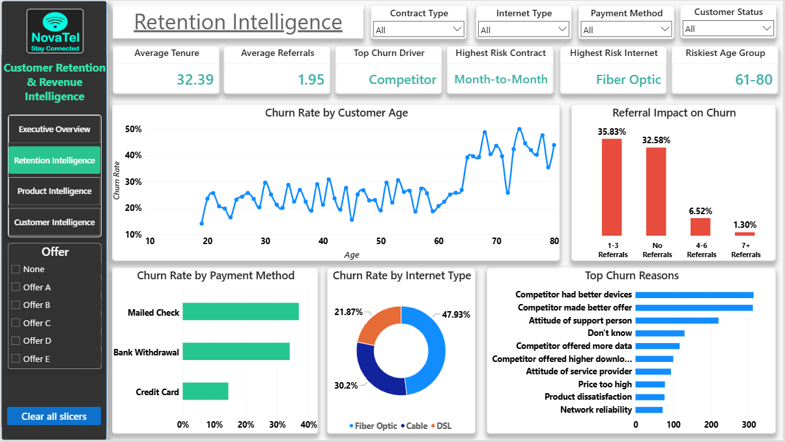
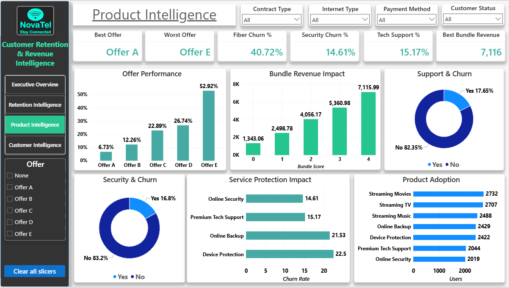
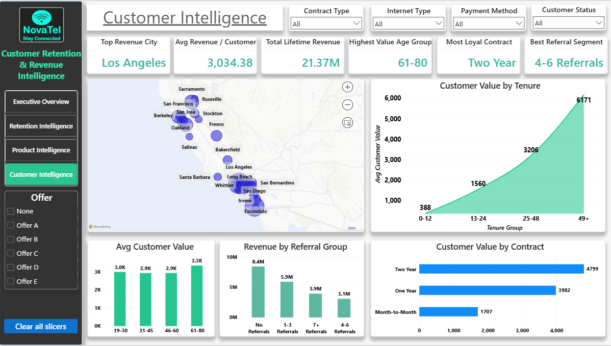

# 📞 NovaTel Customer Retention & Revenue Intelligence

<p align="center">
  
</p>

<p align="center">


</p>

<p align="center">
<b>End-to-End Customer Retention Analytics Project | SQL + Python + Power BI</b>
</p>

---

# 🚀 Project Overview

Customer retention is one of the most important growth drivers in the telecommunications industry. Acquiring new customers is significantly more expensive than retaining existing ones, making churn reduction a critical business objective.

This project analyzes customer behavior, churn patterns, revenue exposure, loyalty indicators, and product adoption trends for **NovaTel**, a fictional telecommunications company created for portfolio and business analysis purposes.

Using **Python**, **SQL**, and **Power BI**, this project transforms raw customer data into actionable business intelligence that supports retention and revenue optimization strategies.

### 🎯 Dataset Source

**Maven Analytics Telecom Customer Churn Dataset**

---

# 📂 Dataset Files

### Raw Data

* telecom_customer_churn.csv
* telecom_zipcode_population.csv
* telecom_data_dictionary.csv

### Processed Data

* service_adoption.xlsx
* service_protection.xlsx

---

# 🎯 Business Problem

NovaTel's leadership team requires visibility into:

* 📉 Customer Churn Risk
* 💰 Revenue Exposure
* 🤝 Customer Loyalty
* 🛡️ Service Retention Impact
* 📦 Product Adoption Behavior
* 📈 Customer Lifetime Value

The objective is to identify the factors driving customer attrition and uncover opportunities to improve retention, increase customer value, and protect recurring revenue.

---

# 🎯 Project Objectives

✅ Identify key customer churn drivers

✅ Quantify revenue at risk

✅ Discover high-risk customer segments

✅ Analyze loyalty and referral behavior

✅ Evaluate product and service effectiveness

✅ Develop a KPI-driven retention framework

✅ Build an executive-level Power BI dashboard

✅ Generate strategic business recommendations

---

# 🛠️ Technology Stack

| Category              | Tools               |
| --------------------- | ------------------- |
| Programming           | Python              |
| Data Analysis         | Pandas, NumPy       |
| Database              | SQL                 |
| Business Intelligence | Power BI            |
| Data Modeling         | Power BI Data Model |
| Reporting             | Markdown            |
| Version Control       | Git & GitHub        |

---

# 📂 Project Structure

```text
NovaTel-Customer-Retention-Revenue-Intelligence

├── data
│   ├── raw
│   │   ├── telecom_customer_churn.csv
│   │   ├── telecom_data_dictionary.csv
│   │   └── telecom_zipcode_population.csv
│   │
│   └── processed
│       ├── service_adoption.xlsx
│       └── service_protection.xlsx
│
├── images
│   ├── dashboard_overview.png
│   ├── executive_overview.png
│   ├── retention_intelligence.png
│   ├── product_intelligence.png
│   └── customer_intelligence.png
│
├── notebooks
│   ├── 01_Data_Audit.ipynb
│   ├── 02_Data_Cleaning.ipynb
│   ├── 03_Data_Modeling.ipynb
│   ├── 04_Exploratory_Data_Analysis.ipynb
│   └── 05_KPI_Framework.ipynb
│
├── powerbi
│   ├── Dashboard_Notes.md
│   └── NovaTel_Customer_Retention_Revenue_Intelligence.pbix
│
├── reports
│   ├── Business_Report.md
│   └── Final_Project_Report.md
│
├── sql
│   ├── 01_Data_Validation.sql
│   ├── 02_Customer_Churn_Analysis.sql
│   ├── 03_Revenue_Analysis.sql
│   ├── 04_Loyalty_Analysis.sql
│   ├── 05_Product_Analysis.sql
│   └── SQL_Analysis_Summary.md
│
├── requirements.txt
├── .gitignore
└── README.md
```

---

# 🔄 Analytics Workflow

```text
Business Understanding
        ↓
Data Audit
        ↓
Data Cleaning
        ↓
Data Modeling
        ↓
SQL Business Analysis
        ↓
Exploratory Data Analysis
        ↓
KPI Framework
        ↓
Power BI Dashboard
        ↓
Business Recommendations
```

---

# 📈 Executive KPI Framework

| KPI                      |          Value |
| ------------------------ | -------------: |
| 👥 Total Customers       |          7,043 |
| 📉 Churn Rate            |         26.54% |
| 💰 Total Revenue         |  21.36 Million |
| ⚠️ Revenue At Risk       |   3.68 Million |
| 📋 Highest Risk Contract | Month-to-Month |
| 🌐 Highest Risk Internet |    Fiber Optic |
| 🎯 Best Performing Offer |        Offer A |
| ❌ Worst Performing Offer |        Offer E |

---

# 💡 Key Business Insights

## 📉 Customer Retention Intelligence

* Churn Rate reached **26.54%**
* Month-to-Month customers showed **45.84% churn**
* Fiber Optic customers experienced **40.72% churn**
* Customers aged **61–80** represented the highest-risk age segment
* Competitor-related churn accounted for nearly **45%** of customer losses

---

## 💰 Revenue Intelligence

* Total Revenue exceeded **21.36 Million**
* Revenue At Risk reached **3.68 Million**
* Competitor churn generated **1.69 Million** in lost revenue
* Two-Year contracts produced the highest revenue contribution

---

## 🛡️ Product Intelligence

* Online Security significantly reduced churn risk
* Premium Tech Support demonstrated strong retention impact
* Offer A delivered the strongest retention performance
* Offer E recorded the highest churn levels
* Higher service adoption increased customer value and revenue generation

---

## 🤝 Customer Loyalty Intelligence

* Stayed customers averaged **41 months tenure**
* Churned customers averaged **18 months tenure**
* Customers with **7+ referrals** exhibited only **1.3% churn**
* Referral behavior emerged as one of the strongest indicators of customer loyalty

---

# 📊 Additional Analytical Tables

Two analytical tables were created from SQL analysis outputs and imported into Power BI.

### service_adoption.xlsx

Used to analyze:

* Bundle Score Performance
* Service Adoption Trends
* Revenue Contribution by Service Adoption

### service_protection.xlsx

Used to analyze:

* Online Security Impact
* Premium Tech Support Impact
* Service Protection Effectiveness

These tables were intentionally kept independent from the primary data model and support Product Intelligence visualizations.

---

# 📊 Dashboard Preview

## 🏢 Executive Overview



### Dashboard Focus

* Customer Status Analysis
* Revenue Monitoring
* Churn Performance
* Contract Analysis
* Revenue Risk Analysis

---

## 🎯 Retention Intelligence



### Dashboard Focus

* Churn Drivers
* Customer Risk Segments
* Referral Analysis
* Payment Method Analysis
* Customer Age Analysis

---

## 🛡️ Product Intelligence



### Dashboard Focus

* Offer Performance
* Product Adoption
* Service Protection Impact
* Bundle Revenue Analysis
* Retention Service Analysis

---

## 👥 Customer Intelligence



### Dashboard Focus

* Customer Value Analysis
* Revenue Distribution
* Geographic Insights
* Loyalty Segmentation
* Contract Intelligence

---

# 🧠 SQL Business Analysis

SQL was used to perform targeted business analysis across multiple domains.

### 📉 Customer Churn Analysis

* Customer Risk Segmentation
* Contract Risk Analysis
* Internet Service Risk Analysis
* Churn Driver Analysis

### 💰 Revenue Analysis

* Revenue Contribution Analysis
* Revenue Risk Assessment
* Contract Revenue Analysis
* Revenue Loss Analysis

### 🤝 Loyalty Analysis

* Customer Tenure Analysis
* Referral Impact Analysis
* Loyalty Segmentation

### 🛡️ Product Analysis

* Product Adoption Analysis
* Service Protection Analysis
* Offer Performance Analysis

---

# 🚀 Strategic Recommendations

## Reduce Competitor-Driven Churn

* Launch targeted retention campaigns
* Improve customer engagement initiatives
* Strengthen loyalty programs

---

## Increase Long-Term Contract Adoption

* Promote contract upgrade incentives
* Reward customer loyalty
* Encourage long-term subscriptions

---

## Expand Retention-Focused Services

Focus adoption efforts on:

* Online Security
* Premium Tech Support
* Device Protection Plans
* Online Backup

---

## Strengthen Referral Programs

* Introduce referral incentives
* Reward customer advocacy
* Encourage customer engagement

---

## Prioritize High-Risk Segments

Target:

* Month-to-Month Customers
* Fiber Optic Customers
* Senior Customer Segments
* Low Engagement Customers

---

# 📈 Business Impact

This project demonstrates the complete analytics lifecycle:

✅ Business Understanding

✅ Data Audit

✅ Data Cleaning

✅ Data Modeling

✅ SQL Analysis

✅ Exploratory Data Analysis

✅ KPI Development

✅ Power BI Dashboarding

✅ Business Intelligence Reporting

✅ Strategic Recommendations

---

# 📚 Project Documentation

| Document                | Purpose                                    |
| ----------------------- | ------------------------------------------ |
| Dashboard_Notes.md      | Dashboard Architecture & DAX Documentation |
| Business_Report.md      | Executive Business Analysis                |
| Final_Project_Report.md | Technical Project Documentation            |
| SQL_Analysis_Summary.md | SQL Findings Summary                       |

---

# 🏆 Project Highlights

⭐ End-to-End Data Analytics Project

⭐ Customer Retention Intelligence System

⭐ SQL + Python + Power BI Integration

⭐ Executive KPI Framework

⭐ Interactive Business Intelligence Dashboard

⭐ Revenue Risk Analysis

⭐ Customer Loyalty Analytics

⭐ Product Adoption Intelligence

⭐ Strategic Business Recommendations

⭐ Portfolio-Ready Analytics Project

---

# 👨‍💻 Author

## Sandeep Kumar


<p align="center">
<b>📊 Transforming Customer Data into Retention Intelligence</b>
</p>

<p align="center">
⭐ If you found this project interesting, consider giving it a star!
</p>
